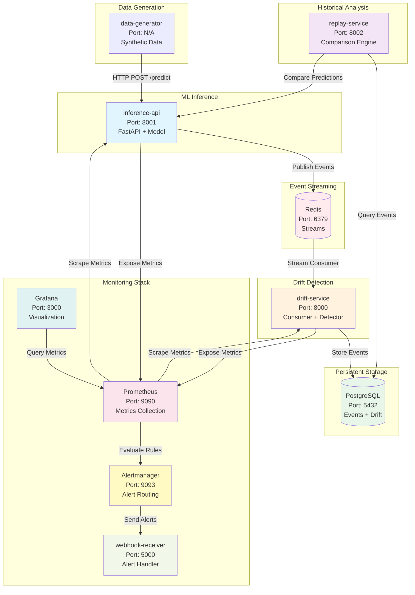
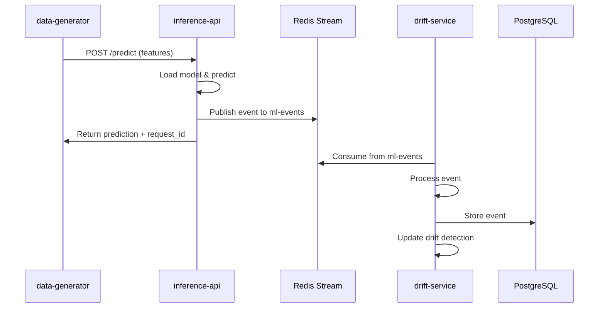
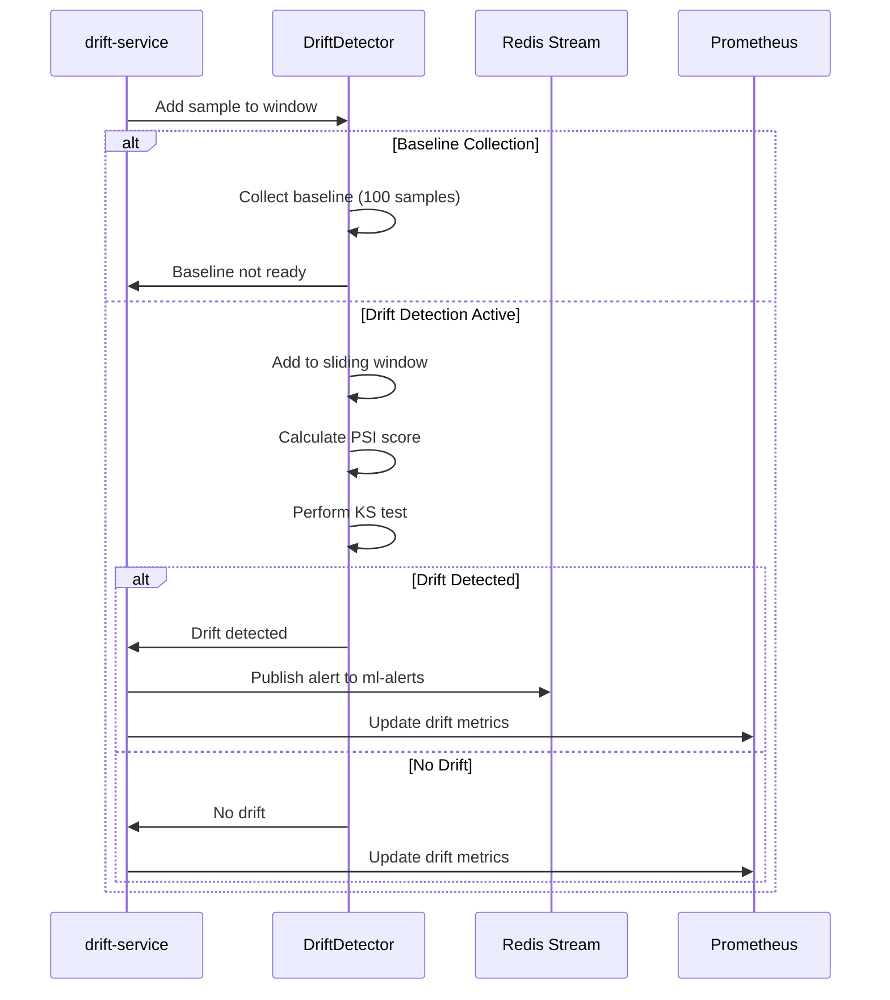
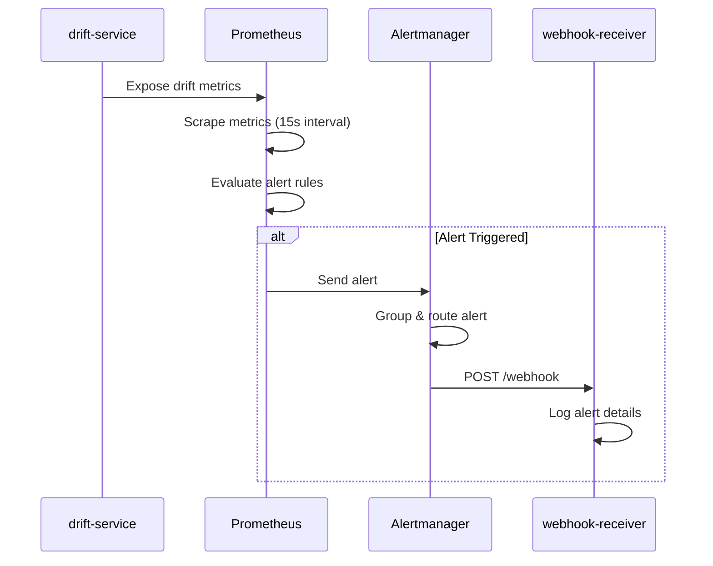
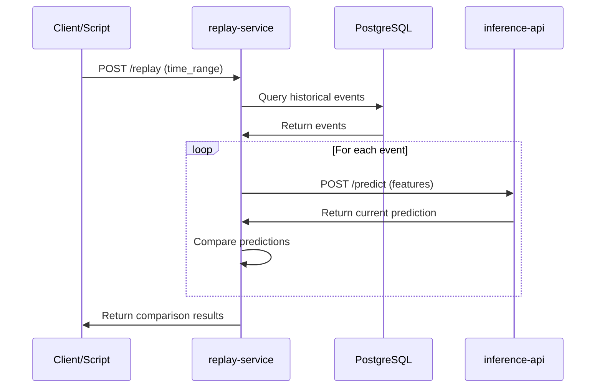
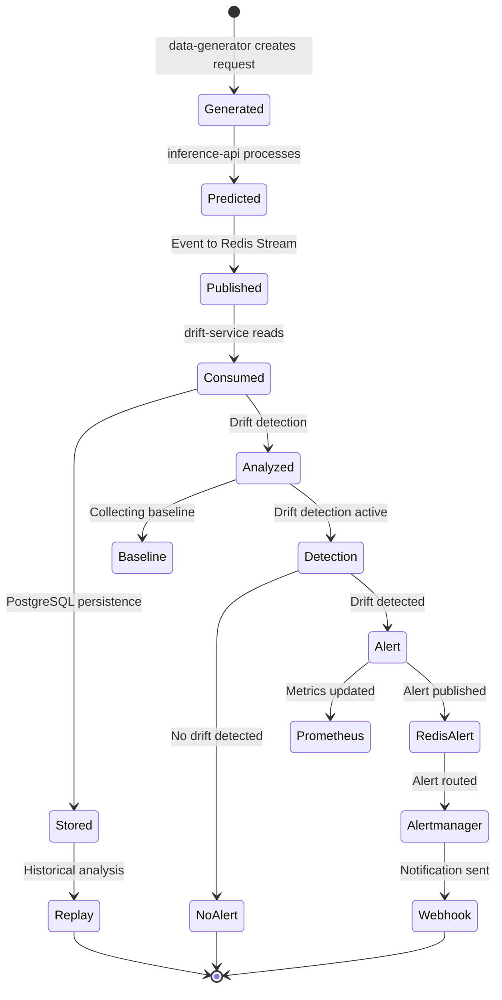
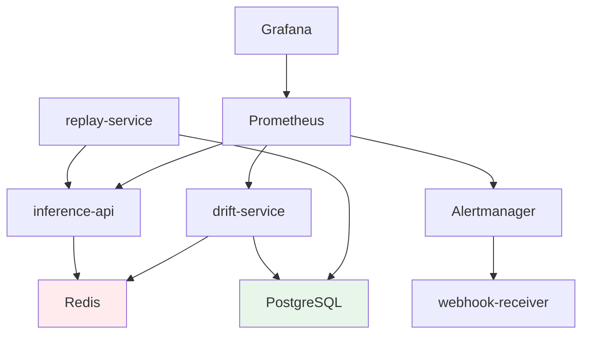

# ML Observability Platform Architecture

## Overview

The ML Observability Platform is a comprehensive, event-driven system designed to monitor machine learning models in production. It provides real-time drift detection, historical replay capabilities, and automated alerting for ML model performance degradation.

### Key Capabilities

- **Real-time Drift Detection**: Monitors feature and prediction distributions using PSI and KS statistical tests
- **Event-Driven Architecture**: Leverages Redis Streams for scalable event processing
- **Historical Replay**: Compares current predictions against historical baselines
- **Automated Alerting**: Prometheus-based alerting with webhook notifications
- **Comprehensive Monitoring**: Grafana dashboards for visualization and analysis
- **Persistent Storage**: PostgreSQL for long-term event and drift history

## System Architecture

## Components

### Core Services

#### inference-api
**Purpose**: ML model serving with event streaming

**Responsibilities**:
- Serve ML predictions via REST API
- Publish prediction events to Redis Streams
- Expose Prometheus metrics for inference latency
- Health check endpoint for orchestration

**Technology**: FastAPI, scikit-learn, Redis client

**Key Endpoints**:
- `POST /predict` - Make predictions
- `GET /health` - Health check
- `GET /` - API information

**Event Schema**: Publishes events matching `schemas/event_schema.json` to Redis Stream `ml-events`

#### drift-service
**Purpose**: Real-time drift detection engine

**Responsibilities**:
- Consume events from Redis Streams
- Detect feature drift using PSI (Population Stability Index)
- Detect feature drift using KS (Kolmogorov-Smirnov) test
- Detect prediction distribution drift
- Publish alerts to Redis alert stream
- Store events in PostgreSQL for historical analysis
- Expose Prometheus metrics for drift scores

**Technology**: Python, Redis Streams, PostgreSQL, NumPy, SciPy

**Configuration**:
- Baseline window: 100 samples
- Sliding window: 100 samples
- PSI threshold: 0.2
- KS p-value threshold: 0.05

**Metrics Exposed**:
- `ml_drift_score` - Unified drift score (max of feature drifts)
- `ml_drift_psi_score` - PSI score per feature
- `ml_drift_ks_statistic` - KS statistic per feature
- `ml_drift_detected_total` - Drift detection counter
- `ml_baseline_samples` - Baseline collection progress
- `ml_sliding_window_samples` - Sliding window size

#### replay-service
**Purpose**: Historical prediction comparison

**Responsibilities**:
- Retrieve historical events from PostgreSQL
- Replay predictions through current model
- Compare historical vs current predictions
- Identify model behavior changes
- Expose comparison metrics

**Technology**: FastAPI, PostgreSQL, HTTP client

**Key Endpoints**:
- `POST /replay` - Replay historical events
- `GET /health` - Health check

### Infrastructure Components

#### Prometheus
**Purpose**: Metrics collection and alerting

**Responsibilities**:
- Scrape metrics from inference-api (port 8001)
- Scrape metrics from drift-service (port 8000)
- Evaluate alert rules for drift detection
- Forward alerts to Alertmanager
- Store time-series metrics data

**Configuration**: `infra/prometheus.yml`, `infra/alerts.yml`

**Scrape Targets**:
- `inference-api:8001/metrics`
- `drift-service:8000/metrics`

#### Grafana
**Purpose**: Visualization and dashboards

**Responsibilities**:
- Query Prometheus for metrics
- Display real-time drift monitoring dashboards
- Visualize prediction distributions
- Show system health metrics
- Provide historical trend analysis

**Dashboards**:
- Drift Detection Dashboard
- Drift Monitoring Dashboard
- Prediction Distribution Dashboard
- System Health Dashboard

**Access**: http://localhost:3000 (admin/admin)

#### Alertmanager
**Purpose**: Alert routing and notification

**Responsibilities**:
- Receive alerts from Prometheus
- Route alerts based on severity
- Send notifications to webhook-receiver
- Handle alert grouping and deduplication
- Manage alert silencing

**Configuration**: `infra/alertmanager.yml`

#### webhook-receiver
**Purpose**: Alert handling and logging

**Responsibilities**:
- Receive webhook notifications from Alertmanager
- Log alert details for debugging
- Provide health check endpoint
- Can be extended for custom alert actions

**Technology**: Flask

**Endpoint**: `POST /webhook` - Receive alerts

### Storage Systems

#### Redis
**Purpose**: Event streaming and real-time data

**Responsibilities**:
- Stream prediction events (`ml-events` stream)
- Stream drift alerts (`ml-alerts` stream)
- Support consumer groups for scalable processing
- Provide persistence with AOF (Append-Only File)

**Technology**: Redis 7 with Alpine Linux

**Streams**:
- `ml-events` - Prediction events from inference-api
- `ml-alerts` - Drift alerts from drift-service

#### PostgreSQL
**Purpose**: Persistent event storage

**Responsibilities**:
- Store all prediction events for historical analysis
- Store drift detection results
- Enable replay service queries
- Provide ACID guarantees for data integrity

**Technology**: PostgreSQL 15 with Alpine Linux

**Database**: `ml_observability`

**Tables**:
- `events` - Prediction events with features and predictions
- `drift_results` - Drift detection history

## Data Flow

### Prediction Flow

**Step-by-step**:
1. **Data Generator** sends prediction request with features to inference-api
2. **Inference API** loads model and generates prediction
3. **Inference API** publishes event to Redis Stream `ml-events` with schema:
   - request_id, timestamp, model_version
   - features (feature_1, feature_2, feature_3)
   - prediction (label, confidence)
   - metadata (latency_ms, environment, region)
4. **Inference API** returns prediction response to data-generator
5. **Drift Service** consumes event from Redis Stream
6. **Drift Service** stores event in PostgreSQL
7. **Drift Service** updates drift detection windows

### Drift Detection Flow

**Step-by-step**:
1. **Drift Service** receives event from Redis Stream
2. **Phase 1 - Baseline Collection** (first 100 samples):
   - Collect samples for baseline distribution
   - Store feature statistics (mean, std, distribution)
   - No drift detection performed
3. **Phase 2 - Drift Detection** (after baseline complete):
   - Add sample to sliding window (100 samples)
   - Calculate PSI (Population Stability Index) for each feature
   - Perform KS (Kolmogorov-Smirnov) test for each feature
   - Check prediction distribution drift
4. **If Drift Detected**:
   - Publish alert to Redis `ml-alerts` stream
   - Update Prometheus metrics with drift scores
   - Log drift details (feature, score, statistics)
5. **Metrics Update**:
   - Update `ml_drift_score` (unified metric)
   - Update `ml_drift_psi_score` per feature
   - Update `ml_drift_ks_statistic` per feature
   - Increment `ml_drift_detected_total` counter

### Alert Flow

**Step-by-step**:
1. **Drift Service** exposes metrics at `/metrics` endpoint
2. **Prometheus** scrapes metrics every 15 seconds
3. **Prometheus** evaluates alert rules defined in `infra/alerts.yml`:
   - `HighDriftDetected` - PSI score > 0.2 for 2 minutes
   - `CriticalDriftDetected` - PSI score > 0.5 for 1 minute
4. **If Alert Condition Met**:
   - Prometheus sends alert to Alertmanager
5. **Alertmanager** processes alert:
   - Groups related alerts
   - Routes based on severity
   - Sends webhook notification
6. **Webhook Receiver** handles notification:
   - Logs alert details
   - Can trigger custom actions (email, Slack, PagerDuty)

### Replay Flow

**Step-by-step**:
1. **Client** sends replay request with time range
2. **Replay Service** queries PostgreSQL for historical events
3. **For Each Historical Event**:
   - Extract original features
   - Send features to current inference-api
   - Receive current prediction
   - Compare with historical prediction
4. **Comparison Analysis**:
   - Calculate prediction agreement rate
   - Identify changed predictions
   - Compute confidence differences
5. **Return Results**:
   - Summary statistics
   - List of changed predictions
   - Drift indicators

## Event Lifecycle

### Complete Event Journey

**Detailed Lifecycle**:

1. **Event Creation** (inference-api):
   - Request received with features
   - Model generates prediction
   - Event created with schema v1.0
   - Unique request_id assigned (UUID)
   - Timestamp in ISO-8601 UTC format

2. **Event Publishing** (inference-api → Redis):
   - Event serialized to JSON
   - Published to `ml-events` stream
   - Redis assigns message ID
   - Event persisted with AOF

3. **Event Consumption** (drift-service):
   - Consumer group reads from stream
   - Event deserialized and validated
   - Acknowledged after processing
   - Metrics recorded (processing time)

4. **Event Storage** (drift-service → PostgreSQL):
   - Event inserted into `events` table
   - Indexed by timestamp and request_id
   - Available for historical queries
   - ACID guarantees maintained

5. **Drift Analysis** (drift-service):
   - **Baseline Phase** (samples 1-100):
     - Features added to baseline window
     - Statistics calculated (mean, std)
     - Distribution histograms created
   - **Detection Phase** (samples 101+):
     - Features added to sliding window
     - PSI calculated vs baseline
     - KS test performed vs baseline
     - Prediction distribution compared

6. **Alert Generation** (if drift detected):
   - Alert data structure created
   - Published to `ml-alerts` stream
   - Prometheus metrics updated
   - Alert rules evaluated

7. **Alert Routing** (Prometheus → Alertmanager):
   - Alert sent to Alertmanager
   - Grouped with similar alerts
   - Routed based on severity
   - Webhook notification sent

8. **Historical Replay** (replay-service):
   - Events queried from PostgreSQL
   - Features re-submitted to current model
   - Predictions compared
   - Drift analysis performed

## Network Architecture

### Port Mapping

| Service | Internal Port | External Port | Protocol | Purpose |
|---------|--------------|---------------|----------|---------|
| inference-api | 8001 | 8001 | HTTP | Prediction API |
| drift-service | 8000 | 8000 | HTTP | Metrics endpoint |
| replay-service | 8002 | 8002 | HTTP | Replay API |
| Redis | 6379 | 6379 | TCP | Event streaming |
| PostgreSQL | 5432 | 5432 | TCP | Database |
| Prometheus | 9090 | 9090 | HTTP | Metrics & UI |
| Grafana | 3000 | 3000 | HTTP | Dashboards |
| Alertmanager | 9093 | 9093 | HTTP | Alert management |
| webhook-receiver | 5000 | 5000 | HTTP | Alert webhook |

### Network Topology

All services run on a Docker bridge network `ml-obs-network`:
- Internal DNS resolution by service name
- Isolated from host network
- Port forwarding for external access
- Health checks on all services

### Service Dependencies

**Startup Order**:
1. Redis (no dependencies)
2. PostgreSQL (no dependencies)
3. Prometheus (no dependencies)
4. Alertmanager (no dependencies)
5. webhook-receiver (no dependencies)
6. inference-api (depends on Redis)
7. drift-service (depends on Redis, PostgreSQL)
8. replay-service (depends on PostgreSQL, inference-api)
9. Grafana (depends on Prometheus)

### Health Checks

All services implement health check endpoints:
- **Interval**: 15 seconds (10s for Redis/PostgreSQL)
- **Timeout**: 5 seconds
- **Retries**: 3 attempts
- **Start Period**: 10-30 seconds (service-dependent)

Health check ensures:
- Service is responsive
- Dependencies are connected
- Ready to accept traffic

## Technology Stack

### Languages & Frameworks
- **Python 3.11**: Core services (inference-api, drift-service, replay-service)
- **FastAPI**: REST API framework
- **Flask**: Webhook receiver

### Data Processing
- **NumPy**: Numerical computations
- **SciPy**: Statistical tests (KS test)
- **Pandas**: Data manipulation (optional)

### Storage
- **Redis 7**: Event streaming with Streams API
- **PostgreSQL 15**: Relational database for events

### Monitoring
- **Prometheus**: Metrics collection and alerting
- **Grafana**: Visualization and dashboards
- **Alertmanager**: Alert routing

### Orchestration
- **Docker Compose**: Multi-container orchestration
- **Docker**: Containerization

### ML Framework
- **scikit-learn**: Model training and inference

## Scalability Considerations

### Horizontal Scaling

**drift-service**:
- Multiple consumers in same consumer group
- Redis Streams distributes events across consumers
- Each consumer processes different events
- Scale by adding more consumer instances

**inference-api**:
- Stateless service, easily replicated
- Load balancer distributes requests
- Each instance publishes to same Redis Stream

### Vertical Scaling

**PostgreSQL**:
- Increase memory for larger datasets
- Add indexes for query optimization
- Consider partitioning for time-series data

**Redis**:
- Increase memory for larger stream buffers
- Configure maxmemory-policy for eviction
- Monitor stream length and trim old events

### Performance Optimization

- **Batch Processing**: drift-service reads 10 events per iteration
- **Async I/O**: FastAPI uses async/await for non-blocking operations
- **Connection Pooling**: PostgreSQL connections reused
- **Metrics Caching**: Prometheus scrapes at 15s intervals

## Security Considerations

### Current Implementation
- Default passwords (development only)
- No TLS/SSL encryption
- No authentication on APIs
- Internal network only

### Production Recommendations
- Use secrets management (Vault, AWS Secrets Manager)
- Enable TLS for all HTTP endpoints
- Implement API authentication (JWT, OAuth2)
- Use PostgreSQL SSL connections
- Enable Redis AUTH
- Network policies for pod-to-pod communication
- Regular security updates for base images

## Monitoring & Observability

### Key Metrics

**Inference Metrics**:
- `ml_predictions_total` - Total predictions made
- `ml_inference_latency_seconds` - Prediction latency

**Drift Metrics**:
- `ml_drift_score` - Unified drift score (max of features)
- `ml_drift_psi_score` - PSI score per feature
- `ml_drift_ks_statistic` - KS statistic per feature
- `ml_drift_detected_total` - Drift detection counter
- `ml_baseline_samples` - Baseline collection progress
- `ml_sliding_window_samples` - Sliding window size

**System Metrics**:
- `ml_events_processed_total` - Events processed
- `ml_processing_duration_seconds` - Processing time
- `ml_alerts_published_total` - Alerts published

### Logging

All services use structured logging:
- **Format**: `timestamp - service - level - message`
- **Levels**: DEBUG, INFO, WARNING, ERROR
- **Output**: stdout (captured by Docker)

### Tracing

Request tracing via `request_id`:
- Generated by inference-api
- Propagated through all services
- Enables end-to-end request tracking

---

**Document Version**: 1.0  
**Last Updated**: 2026-04-28  
**Maintained By**: ML Observability Team